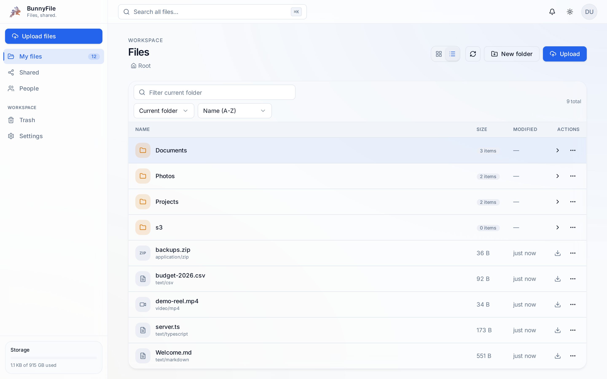
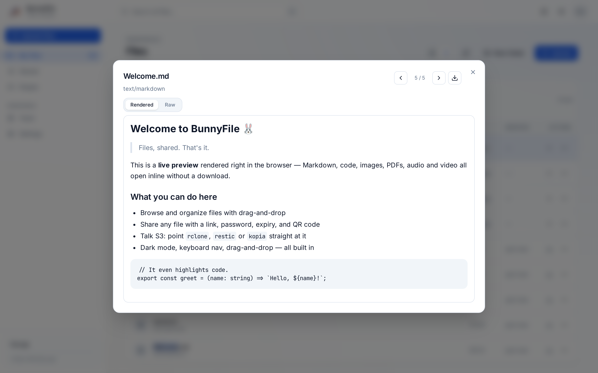
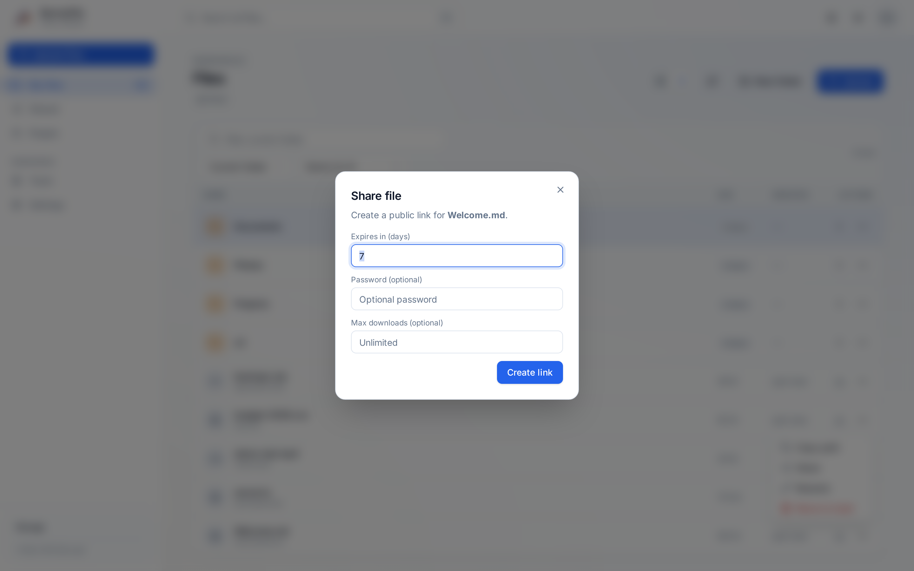

# BunnyFile 🐰

> Files, shared. That's it.

Lightweight self-hosted file hosting and sharing, built on Bun. S3-compatible API, upload progress feedback, and a minimal architecture. Replaces the "files" half of Nextcloud — nothing more.

**License:** [AGPL-3.0](./LICENSE).

## Non-goals (what BunnyFile deliberately is NOT)

- ❌ Nextcloud clone
- ❌ Sync client (use Syncthing / rclone)
- ❌ WebDAV / SFTP / FTP (use SFTPGo or rclone in front)
- ❌ Calendar / contacts / mail / Talk / collaborative editing
- ❌ Plugin marketplace
- ❌ Enterprise SSO / LDAP

If you need those, Nextcloud and Seafile are great. BunnyFile wins by being less.

## The pitch

- **Fast:** cold start <500ms, idle RAM <100MB
- **Compatible:** first-class S3 API — rclone, aws-cli, restic, kopia, Cyberduck all just work
- **Minimal:** Bun + SQLite + local filesystem. No Redis, no MariaDB, no Elasticsearch
- **Reliable:** upload progress feedback in the SPA plus byte-exact integrity testing

## Install (production)

One container. Elysia serves `/api/*` and the built SPA on `/` — no second server.

Pre-built images publish to GHCR on every GitHub Release:

```bash
docker run -d --name bunnyfile \
  -p 3901:3901 \
  -v bunnyfile-data:/data \
  -e BETTER_AUTH_SECRET="$(openssl rand -hex 32)" \
  ghcr.io/samuelloranger/bunnyfile:latest
```

Open `http://localhost:3901` — the first account you create becomes the admin.

**Compose stacks** in [`deploy/compose/`](./deploy/compose/):

| File | Use case |
|---|---|
| `standalone.yml` | Single container + volume |
| `caddy.yml` | HTTPS reverse proxy (recommended for any internet-facing deploy) |
| `tinyauth.yml` | Forward-auth layout (see PLAN.md) |

Copy `deploy/compose/.env.example` → `.env` and set `BETTER_AUTH_SECRET` before first boot.

> Build from source instead: `docker build -t bunnyfile .`

## Screenshots

> Regenerated automatically on every release by [`.github/workflows/screenshots.yml`](./.github/workflows/screenshots.yml) against seeded demo data.

| File browser | Preview | Share |
|---|---|---|
|  |  |  |

## Security

Designed to be safe behind a reverse proxy. What's in the box:

- **Auth:** native email/password via [better-auth](https://better-auth.com) (scrypt hashing, cookie sessions, 30-day expiry). First signup becomes admin; admins manage users on `/people`. Alternatively run in **forward-auth** mode behind Tinyauth/Caddy — one mode at a time.
- **Origin policy:** a single trusted-origin allowlist (localhost + RFC1918 LAN + explicit `WEB_ORIGIN` / env entries) backs both the CSRF check and CORS, so they can't disagree.
- **Share links:** optional password, expiry, and max-download count; expired/exhausted links render a 410. Public share access is rate-limited (in-memory token bucket).
- **Data integrity:** every file write is write-then-rename with a checksum recorded in SQLite; integration tests verify byte-exact round trips.

**Operator checklist:**

- Set `BETTER_AUTH_SECRET` to a random 32-byte value before first boot (a dev default is used otherwise and logs a warning).
- Terminate TLS at a reverse proxy (see `deploy/compose/caddy.yml`) — don't expose `:3901` directly.
- Restrict cross-origin access with `WEB_ORIGIN` when serving from a custom domain.

> **Note:** self-service password reset is not implemented yet ([plan](./docs/plans/password-reset.md)) — a forgotten password currently requires an admin to reset it. Found a vulnerability? Open a private security advisory on GitHub rather than a public issue.

## S3-compatible API

BunnyFile speaks enough S3 for rclone, aws-cli, restic, and kopia. The API lives at `/api/s3` on the same host as the web app.

**Quick rclone config:**

```ini
[bunnyfile]
type = s3
provider = Other
env_auth = false
access_key_id = YOUR_KEY
secret_access_key = YOUR_SECRET
endpoint = http://localhost:3901/api/s3
region = us-east-1
force_path_style = true
```

Create per-user keys in the app under **Settings**, or set `S3_ACCESS_KEY_ID` / `S3_SECRET_ACCESS_KEY` in the environment for a single global key.

Full client setup, supported operations, and known limitations: [`docs/s3-compatibility.md`](./docs/s3-compatibility.md).

## Stack

- **Runtime:** Bun ≥ 1.3
- **Server:** Elysia (serves `/api/*` and the built web app on `/`)
- **Web:** React 19 + Vite + TanStack Router + TanStack Query + Tailwind CSS (SPA — no SSR)
- **Storage:** Local filesystem, SQLite (`bun:sqlite`) for metadata
- **Tests:** `bun:test`
- **Lint/format:** Biome
- **Typed API client:** Elysia Eden (web → server)

## Development

```bash
bun install

# Run server + web in parallel (web proxies /api to server)
bun run dev

# Or individually:
bun run dev:server   # → http://localhost:3901
bun run dev:web      # → http://localhost:3900
```

Server exposes `GET /api/health`. In dev, the web app runs on Vite and proxies `/api` to the server.

**Docker (dev)** — Compose assigns random available host ports to avoid collisions:

```bash
bun run docker:up      # starts containers
bun run docker:ports   # prints the assigned URLs
bun run docker:down
```

| Script | What |
|---|---|
| `bun run dev` | Run server + web in parallel (Bun workspaces filter) |
| `bun run build` | Build web → `apps/web/dist` and bundle server |
| `bun test` | Run `bun:test` suites across the workspace |
| `bun run typecheck` | `tsc --noEmit` in every package |
| `bun run lint` / `lint:fix` | Biome |

## Observability

- **OpenAPI / Swagger UI:** `/api/docs` (REST routes; S3 excluded — use AWS docs)
- **Prometheus metrics:** `GET /metrics`
- **Load smoke test:** `bun scripts/load-test.ts http://localhost:3901`

## Docs

| Doc | Contents |
|---|---|
| [`docs/s3-compatibility.md`](./docs/s3-compatibility.md) | S3 client setup, supported ops, limitations |
| [`docs/migrating-from-nextcloud.md`](./docs/migrating-from-nextcloud.md) | Files-only migration guide |
| [`docs/plans/password-reset.md`](./docs/plans/password-reset.md) | Planned self-service password reset flow |

## Roadmap

See [`PLAN.md`](./PLAN.md) for development phases 0–6.
